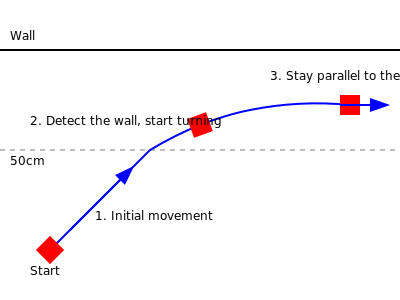

# Mini Eagle with Lateral TOF Sensor

## About Mini Eagle

Mini Eagle is a prototype robot developed by the French EagleTech robotics team, combining Lego motors and structural components with an STM32 board and basic electronics. This platform is designed for rapid iteration and testing of control algorithms. The insights gained from Mini Eagle will be applied to the more advanced Eagle robot, which is being prepared for the Coupe de France de Robotique 2025.

## Project Overview

In this project, the Mini Eagle robot uses motor control and a Time-of-Flight (TOF) sensor looking to its left to maintain a constant distance from a wall using PID (Proportional-Integral-Derivative) control.

As soon it is powered on, the robot immediately starts moving ahead. As soon as it detects a long straight object at close range (< 50 cm), it changes its orientation to stay parallel to the object.



## Hardware Requirements

- STM32F401RE microcontroller board
- Time-of-Flight (TOF) sensor (model: Nucleo-53L4A2)
- 2 x DC motors (model: Lego Mindstorms EV3 Large)
- Motor driver (model: L293DNE)
- 2 x Power supply (DC motors: 4.5V battery - board: 9V battery)

## Software Dependencies

- STM32CubeIDE (version: 1.15.1)

## Project Structure

- `Core/Src/main.c`: Main application logic
- `Core/Src/motor_control.c`: Motor control functions
- `Drivers/TOF/tof_driver.c`: TOF sensor driver
- `Core/Src/robot_control.c`: High-level robot control logic

## Setup and Configuration

1. Clone this repository
2. Open the project in STM32CubeIDE

## Building and Flashing

1. Build the project in STM32CubeIDE
2. Connect your STM32 board
3. Flash the program to the board

## Development Notes

STM32CubeIDE generates codes with DOS line endings. To convert them to Unix line endings, run the following command in the project directory:

```bash
find . \( -name "*.c" -o -name "*.h" -o -name "*.txt" -o -name "*.html" \) -type f -exec dos2unix {} \;
```

## License

This project is licensed under the MIT License.
